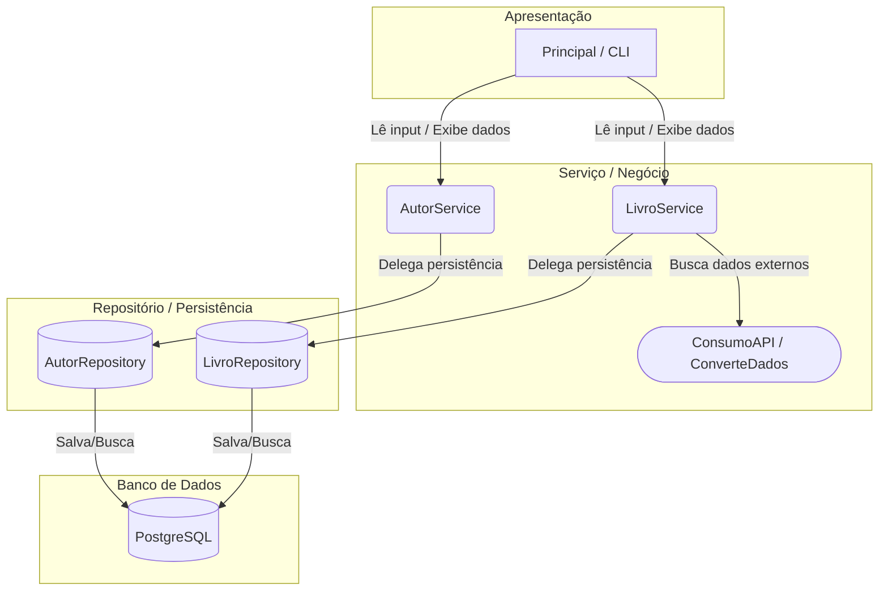

```mermaid
graph TD
subgraph Apresentação
A[Principal / CLI]
end

    subgraph Serviço / Negócio
        B(LivroService)
        C(AutorService)
        API([ConsumoAPI / ConverteDados])
    end

    subgraph Repositório / Persistência
        D[(LivroRepository)]
        E[(AutorRepository)]
    end

    subgraph Banco de Dados
        DB[(PostgreSQL)]
    end

    A -->|Lê input / Exibe dados| B
    A -->|Lê input / Exibe dados| C
    
    B -->|Busca dados externos| API
    B -->|Delega persistência| D
    C -->|Delega persistência| E
    
    D -->|Salva/Busca| DB
    E -->|Salva/Busca| DB
```